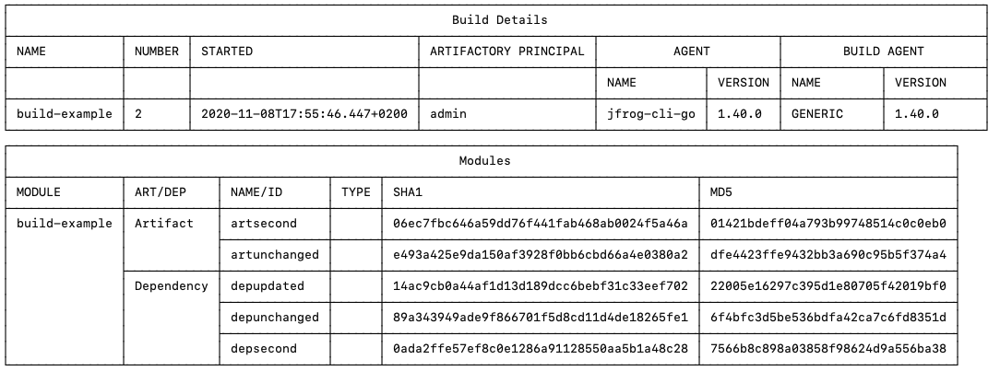

# build-report

## About this plugin
This JFrog CLI plugin prints a report of a published build info in Artifactory, or the diff between two builds.

## Installation with JFrog CLI
Installing the latest version:

`$ jf plugin install build-report`

Installing a specific version:

`$ jf plugin install build-report@version`

Uninstalling a plugin

`$ jf plugin uninstall build-report`

## Usage
### Commands
* view
    - Arguments:
        - build-name - The name of the build you would like to print a report for.
        - build-number - The number of the build you would like to print a report for.
    - Flags:
        - diff - An older build number, to show the diff with the build number passed as an argument.  **[Optional]**
    - Examples:
    
`$ jf build-report view build-example 2`

`$ jf build-report view build-example 2 --diff=1`

### Environment variables
Build details can be passed as environment variables instead of arguments (combining the two is not supported):
* JFROG_CLI_BUILD_NAME
* JFROG_CLI_BUILD_NUMBER

## Additional info
None.

## Release Notes
The release notes are available [here](RELEASE.md).
